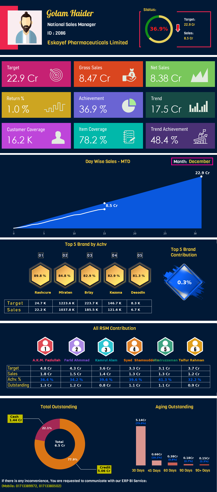

# National_distribution_manager_monthly_evaluation_portfolio_generator
This project generates a monthly evaluation report for each national distribution manager and sends those to the respected emails.

This project is developed using python programming language. It uses some famous libraries like Matplotlib, Numpy, Pandas and Pyodbc. It generates a report for individual national distribution manager to give an overview of what is going on under their supervision. The main goal is to show them that how much they should contribute and how much they are contributing. It is a automatically generated report by this program which sends the report in the respected emails.

Project Output:

